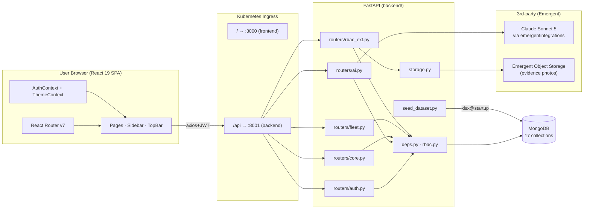
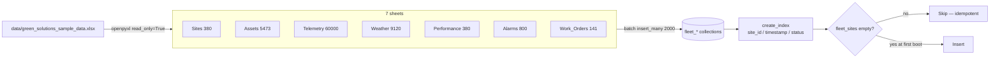
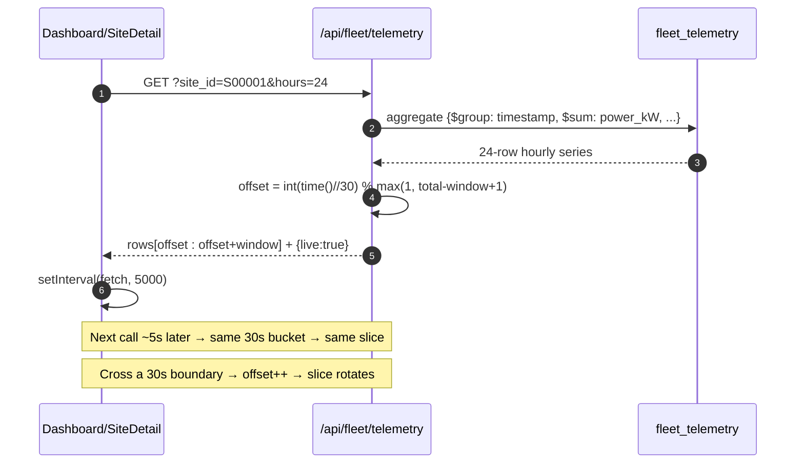
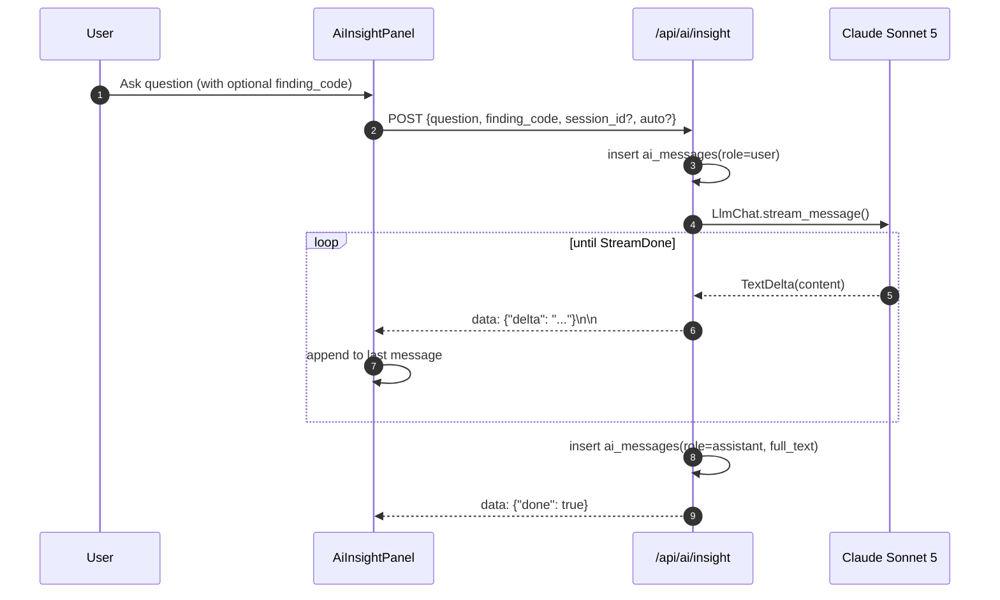
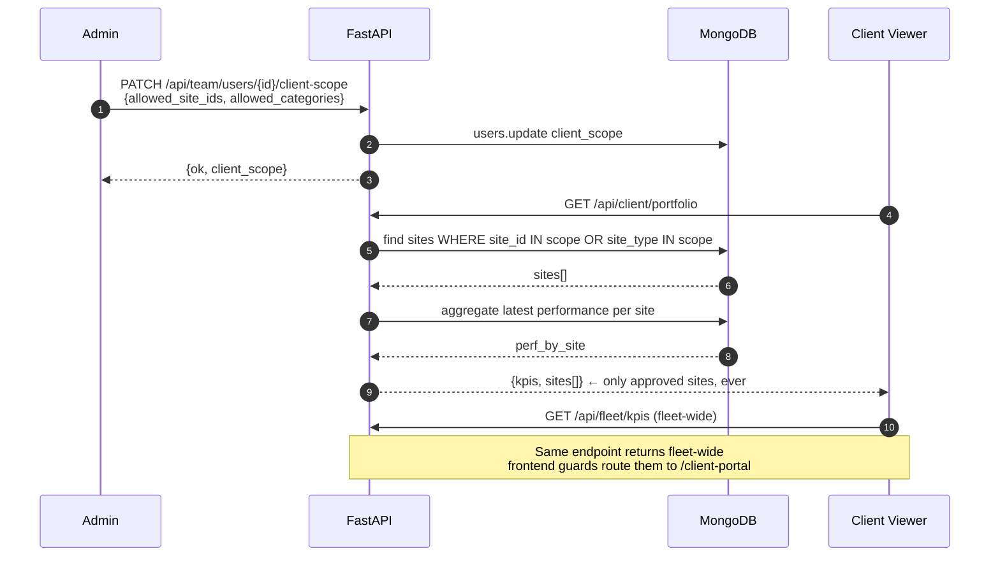
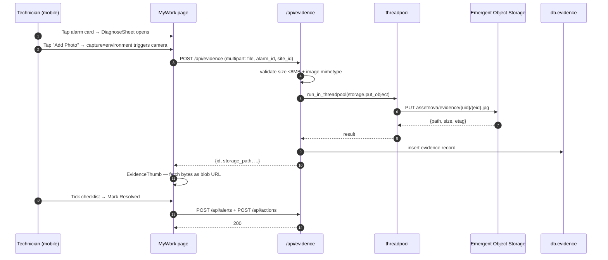

# AssetNova — Architecture (Feb 2026, iteration 14)

AssetNova is a full-stack renewable-energy intelligence platform:
**React 19** frontend, **FastAPI + Motor (MongoDB)** backend, **Claude Sonnet 5** for
AI, **Emergent Object Storage** for field-evidence photos, all deployed behind a
Kubernetes ingress on `emergentagent.com`.

- 7 role-based workspaces (Executive / Asset Manager / O&M / Technician /
  Performance Engineer / Client Viewer / Admin)
- Real dataset ingested from `data/green_solutions_sample_data.xlsx`:
  380 sites, 5,473 assets, 60k telemetry rows, 800 alarms, 141 work orders
- Live-refresh simulation via sliding-window over the telemetry snapshot
- JWT auth, endpoint-level RBAC, workspace switching without re-login
- Field evidence photo upload → Emergent Object Storage

---

## 1. High-level system diagram



---

## 2. Auth + workspace switch flow

```mermaid
sequenceDiagram
    autonumber
    participant U as User
    participant FE as React App
    participant BE as FastAPI
    participant DB as MongoDB

    U->>FE: POST /login (email, password)
    FE->>BE: POST /api/auth/login
    BE->>DB: find_one(users, email)
    DB-->>BE: user + password_hash
    BE->>BE: bcrypt.verify + brute-force check
    BE-->>FE: {access_token, user{id,email,name,role,roles?}}
    FE->>FE: localStorage["gs_token"] = token
    FE->>FE: navigate(landingFor(role))

    Note over FE,BE: Later — user with 2+ roles switches
    U->>FE: TopBar → Workspace Switcher → Executive
    FE->>BE: POST /api/rbac/switch {role:"executive"}
    BE->>BE: check role in effective_roles(user) OR admin
    BE->>DB: update users.role=executive; roles=[…, executive]
    BE-->>FE: {access_token', active_role, roles}
    FE->>FE: replace token, GET /api/auth/me
    FE->>FE: navigate(landingFor("executive"))
```

Key rules:
- Admin is a super-role — always allowed on any endpoint & any switch target.
- `roles[]` is ALWAYS kept in sync so switching is reversible (admin self-lockout
  fix, iteration 14).
- All fleet/alerts/team endpoints run through `rbac.role_required(...)` on the
  server — the frontend guards are a UX layer, not the security boundary.

---

## 3. Role → landing page map

```mermaid
flowchart TB
    L[Login] --> D{role?}
    D -->|admin| A[/admin]
    D -->|executive| O[/overview]
    D -->|asset_manager| B[/dashboard]
    D -->|om_manager| Op[/operations]
    D -->|technician| M[/my-work]
    D -->|performance_engineer| P[/performance]
    D -->|client_viewer| C[/client-portal]

    A --- A1[User mgmt · Multi-role · Client scope · System health]
    O --- O1[Portfolio KPIs · Portfolio mix · Top risks · CO2]
    B --- B1[Category switcher · Fleet KPIs · Sites table · Alarms · WOs · AI panel]
    Op --- Op1[Ops KPIs · Alarms · WOs · Resolution rate]
    M --- M1[Mobile · Alarm cards · Diagnose sheet · Camera evidence]
    P --- P1[Yield · Degradation · Benchmarking · Root cause pareto · Data quality]
    C --- C1[Read-only tiles · Approved sites only · Scope by admin]
```

---

## 4. Fleet dataset ingestion (seed on startup)



The seed runs at startup and is a no-op after the first boot
(`if count_documents({}) > 0: return`). It also builds indexes on site_id, timestamp,
and status per collection.

---

## 5. Live-refresh telemetry (sliding window)



Simulates "live" streaming with a static dataset. Aggregation happens on Mongo,
not in-process, so the window is cheap.

---

## 6. AI Insight (streaming SSE)



- Uses `emergentintegrations` library + `EMERGENT_LLM_KEY`.
- Session-scoped chat history stored in `ai_sessions` + `ai_messages`.
- Frontend supports session list, delete, and auto-alert (triggered by new
  high-severity findings).

---

## 7. Client Viewer — scoped read-only view



Frontend enforces the walled garden by refusing to render Dashboard/Alerts etc. for
`client_viewer`. Backend `/api/client/portfolio` scopes at the query layer, so no
data leaks even if the frontend guard is bypassed.

---

## 8. Field Mobile My Work — evidence upload



- `` tags cannot send `Authorization` headers, so the file endpoint accepts
  `?auth=<jwt>` as a fallback for browser image loading.
- Non-admins only see their own uploads; admins see all.
- All I/O runs in threadpool so an in-flight upload doesn't block the event loop.

---

## 9. Data model (MongoDB collections)

| Collection            | Purpose                                       | Key indexes                       |
|-----------------------|-----------------------------------------------|------------------------------------|
| `users`               | Auth + role + roles[] + client_scope           | email (unique), id (unique)        |
| `password_reset_tokens` | Password reset (TTL)                         | expires_at (TTL), token (unique)   |
| `login_attempts`      | Brute-force lockout                            | identifier                         |
| `ai_sessions`         | Per-user chat sessions                         | user_id                            |
| `ai_messages`         | User + assistant turns                         | session_id                         |
| `portfolios`          | User-defined portfolios (legacy)               | (user_id, id)                      |
| `alerts`              | User-tracked findings (legacy, RBAC-gated)     | (user_id, created_at DESC)         |
| `snapshots`           | Public shareable snapshots (TTL 14d)           | token (unique), expires_at (TTL)   |
| `branding`            | Per-user report branding                       | user_id (unique)                   |
| `actions`             | AI-recommended actions accepted by user        | (user_id, created_at DESC)         |
| `report_schedules`    | Weekly digest cadence                          | user_id (unique)                   |
| `contact_messages`    | Public marketing contact form                  | —                                  |
| **`fleet_sites`**     | 380 real sites                                  | site_id, site_type, state          |
| **`fleet_assets`**    | 5,473 inverters/combiners/trackers/BESS/etc.   | site_id, asset_id, asset_type      |
| **`fleet_telemetry`** | 60,000 hourly power_kW readings                | (site_id, asset_id, timestamp DESC)|
| **`fleet_weather`**   | 9,120 hourly weather rows                      | (site_id, timestamp DESC)          |
| **`fleet_performance`** | 380 daily PR% + availability + revenue loss   | (site_id, date DESC)               |
| **`fleet_alarms`**    | 800 alarms                                     | site_id, timestamp DESC, severity  |
| **`fleet_work_orders`** | 141 work orders                                | site_id, status, alarm_id          |
| **`evidence`**        | Technician-uploaded photos + metadata          | user_id, alarm_id, created_at      |

---

## 10. Repository layout

```
/app/
├── backend/
│   ├── server.py                # thin FastAPI entry — mounts routers, startup hooks
│   ├── deps.py                  # DB client + JWT + bcrypt + get_current_user
│   ├── rbac.py                  # MVP_ROLES, ROLE_LANDING, role_required()
│   ├── models.py                # Pydantic request models
│   ├── storage.py               # Emergent Object Storage helper
│   ├── seed_dataset.py          # XLSX → Mongo idempotent seed
│   ├── data/
│   │   └── green_solutions_sample_data.xlsx
│   ├── routers/
│   │   ├── auth.py              # /auth/* endpoints
│   │   ├── ai.py                # /ai/insight (SSE) + session mgmt
│   │   ├── core.py              # /contact, /portfolios, /team, /alerts, /snapshots, /actions, /reports, /weekly-digest
│   │   ├── fleet.py             # /fleet/* — 9 endpoints on real data
│   │   └── rbac_ext.py          # /rbac/*, /team/users/{id}/roles, /client/*, /evidence/*
│   ├── tests/                   # pytest — 245 tests across iterations
│   ├── requirements.txt
│   └── .env
├── frontend/
│   ├── src/
│   │   ├── App.js               # Router with <Protected allow={[...]}>
│   │   ├── index.css            # theme (bright white + emerald green)
│   │   ├── lib/
│   │   │   ├── api.js           # axios instance + interceptor
│   │   │   └── roles.js         # NAV + LANDING + visibleItems + landingFor
│   │   ├── context/
│   │   │   ├── AuthContext.js   # login/register/logout/switchWorkspace
│   │   │   └── ThemeContext.js
│   │   ├── components/
│   │   │   ├── Layout.jsx       # Sidebar + TopBar + <Outlet/>
│   │   │   ├── Sidebar.jsx      # Role-scoped nav
│   │   │   ├── TopBar.jsx       # Profile menu with mobile workspace switcher
│   │   │   ├── WorkspaceSwitcher.jsx    # desktop switcher
│   │   │   ├── OnboardingTour.jsx
│   │   │   ├── PasswordChangeModal.jsx
│   │   │   ├── dashboard/       # CategorySwitcher, FleetKpiCards, SitesTable, AlarmsFeed, WorkOrdersCard, AiInsightPanel
│   │   │   └── ui/              # shadcn primitives
│   │   └── pages/
│   │       ├── Landing.jsx · Platform.jsx · Solutions.jsx · HowItWorks.jsx · About.jsx · Contact.jsx
│   │       ├── Login.jsx · Register.jsx · ForgotPassword.jsx · ResetPassword.jsx
│   │       ├── Dashboard.jsx · SiteDetail.jsx · Alerts.jsx · Reports.jsx · Team.jsx · Snapshot.jsx
│   │       ├── ExecutiveOverview.jsx    # /overview
│   │       ├── OperationsCenter.jsx     # /operations
│   │       ├── MyWork.jsx               # /my-work (mobile-first + evidence upload)
│   │       ├── PerformanceAnalytics.jsx # /performance
│   │       ├── ClientPortal.jsx         # /client-portal
│   │       └── Administration.jsx       # /admin  (+ Client Scope modal)
│   ├── package.json
│   └── .env
└── memory/
    ├── PRD.md                   # Product Requirements
    ├── ARCHITECTURE.md          # this file
    └── test_credentials.md      # 7 demo accounts
```

---

## 11. Environment variables

| Variable                | Where           | Required | Notes                                 |
|-------------------------|-----------------|----------|---------------------------------------|
| `MONGO_URL`             | backend/.env    | ✅       | e.g. `mongodb://localhost:27017`      |
| `DB_NAME`               | backend/.env    | ✅       | e.g. `test_database`                  |
| `JWT_SECRET`            | backend/.env    | ✅       | Long random string                    |
| `EMERGENT_LLM_KEY`      | backend/.env    | ✅       | Powers AI + Object Storage            |
| `INTEGRATION_PROXY_URL` | backend/.env    | ⚠️       | Emergent internal — defaults if unset |
| `ADMIN_EMAIL`           | backend/.env    | ⛔       | Defaults to `admin@assetnova.com` |
| `ADMIN_PASSWORD`        | backend/.env    | ⛔       | Defaults to `Admin@123`               |
| `FRONTEND_URL`          | backend/.env    | ⛔       | Used in password reset + snapshot URLs|
| `REACT_APP_BACKEND_URL` | frontend/.env   | ✅       | Full external URL, no trailing slash  |

---

## 12. Testing

- **Backend:** `pytest /app/backend/tests/` — 245 tests as of iteration 14
  (auth, RBAC, fleet endpoints, storage, evidence, client scope, workspace switch).
- **Frontend:** Playwright flows exercised by the Emergent testing agent —
  every role's login → landing → cross-role blocking → mobile My Work → evidence
  upload.
- **Iteration reports:** `/app/test_reports/iteration_*.json`
  (14 iterations of test-and-fix loops).
