# Green Solutions — Architecture Reference

> Complete architectural view: workflows, tech stacks, APIs, tests, and agentic AI orchestration.
> Diagrams rendered with **Mermaid** — GitHub, VS Code, and most markdown viewers render them natively.

---

## 01 · High-Level End-to-End Workflow

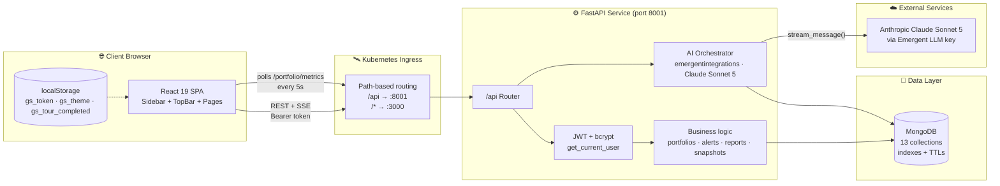

### Request lifecycle (typical dashboard poll)

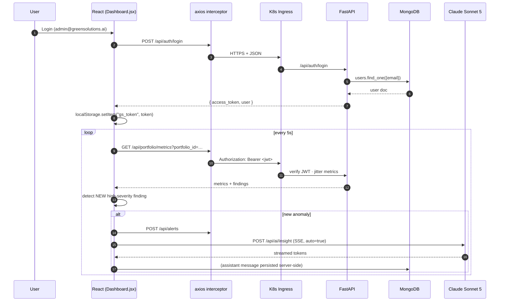

---

## 02 · Detailed Frontend Architecture

### Tech Stack (frontend)

| Layer | Choice | Rationale |
| --- | --- | --- |
| Framework | **React 19** (CRA + CRACO) | Modern hooks, strict mode |
| Routing | **react-router-dom 7** | Nested routes + protected wrapper |
| State | **React Context** (Auth, Theme) | No global store needed at this scale |
| HTTP | **axios 1.18** + interceptor | Bearer token auto-injection |
| Streaming | **fetch + ReadableStream** | Server-Sent Events for AI |
| Styling | **Tailwind 3.4** + shadcn/ui + CSS vars | Consistent tokens for light/dark |
| Icons | **lucide-react** | Consistent stroke line-icons |
| Toasts | **sonner** | Rich success/warning notifications |
| PDF | **jsPDF + html2canvas** | Client-side branded export |
| Font | Bricolage Grotesque + Manrope + JetBrains Mono | Distinctive, non-slop |

### Component & route map

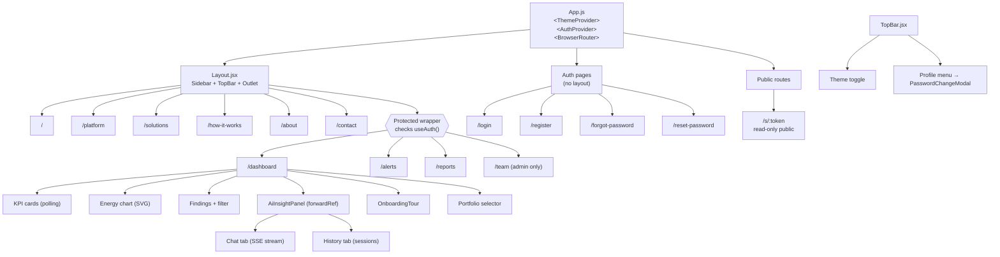

### Frontend runtime data flow

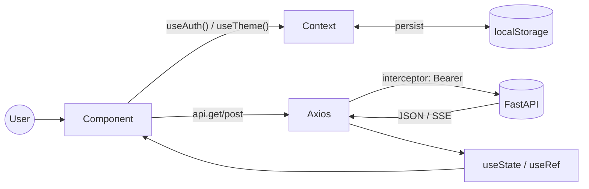

### Key files

```
/app/frontend/src/
├── App.js                       # Router + Providers
├── index.css                    # Design tokens (light + dark)
├── context/
│   ├── AuthContext.js           # user, login, register, logout
│   └── ThemeContext.js          # theme, toggle (persists)
├── lib/api.js                   # axios instance + formatApiError
├── components/
│   ├── Layout.jsx               # Sidebar + TopBar + Outlet
│   ├── Sidebar.jsx              # Vertical nav (RBAC-aware)
│   ├── TopBar.jsx               # Horizontal nav + profile menu
│   ├── OnboardingTour.jsx       # 4-step spotlight tour
│   └── PasswordChangeModal.jsx  # Change-password dialog
└── pages/
    ├── Landing.jsx  Platform.jsx  Solutions.jsx
    ├── HowItWorks.jsx  About.jsx  Contact.jsx
    ├── Login.jsx  Register.jsx
    ├── ForgotPassword.jsx  ResetPassword.jsx
    ├── Dashboard.jsx            # polling + AI + filter + share + export
    ├── Alerts.jsx               # Alert Center
    ├── Reports.jsx              # Scheduler + Branding
    ├── Team.jsx                 # RBAC invite / list / remove
    └── Snapshot.jsx             # Public read-only dashboard
```

---

## 03 · Detailed Backend Architecture

### Tech Stack (backend)

| Layer | Choice | Rationale |
| --- | --- | --- |
| Framework | **FastAPI 0.110** | Async, Pydantic, OpenAPI |
| ASGI Server | **uvicorn 0.25** (supervised) | Prod-ready reload |
| Data client | **motor 3.3** (async pymongo) | Non-blocking Mongo I/O |
| Validation | **Pydantic v2** | Type-safe request models |
| Auth | **PyJWT + bcrypt** | HS256 tokens, salted hashes |
| AI SDK | **emergentintegrations 0.2** | Unified Claude/GPT/Gemini streaming |
| Config | **python-dotenv** | Loaded before any import that needs it |

### Backend layered architecture

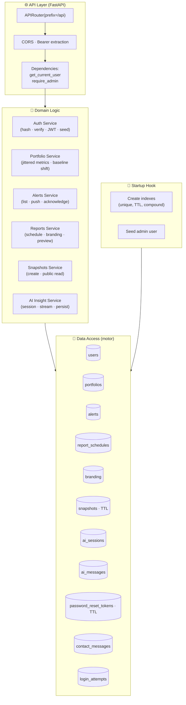

### Backend request path

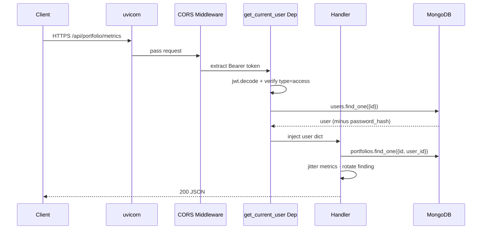

### MongoDB collections & indexes

| Collection | Key indexes | Purpose |
| --- | --- | --- |
| `users` | `email` unique, `id` unique | Auth |
| `password_reset_tokens` | `token` unique, `expires_at` TTL | Forgot-password links |
| `ai_sessions` | `user_id` | Per-user chat sessions |
| `ai_messages` | `session_id` | Message history |
| `report_schedules` | `user_id` unique | Report scheduler config |
| `branding` | `user_id` unique | Company logo + note |
| `portfolios` | `(user_id, id)` compound | Multi-portfolio |
| `alerts` | `(user_id, created_at desc)` | Alert Center feed |
| `snapshots` | `token` unique, `expires_at` TTL | Public share links |
| `contact_messages` | — | Marketing site inbox |
| `login_attempts` | `identifier` | Brute-force guard |

---

## 04 · APIs and Tech Stack

### API surface (all under `/api`, Bearer JWT unless noted)

| Method | Path | Auth | Description |
| --- | --- | --- | --- |
| **Auth** | | | |
| POST | `/auth/register` | Public | Create user + return JWT |
| POST | `/auth/login` | Public | Return JWT |
| GET | `/auth/me` | Bearer | Current user |
| POST | `/auth/change-password` | Bearer | Rotate password |
| POST | `/auth/forgot-password` | Public | Generate reset link (console-logged) |
| POST | `/auth/reset-password` | Public | Consume reset token |
| **Portfolios** | | | |
| GET | `/portfolios` | Bearer | List (auto-seed default) |
| POST | `/portfolios` | Bearer | Create |
| DELETE | `/portfolios/{id}` | Bearer | Remove |
| **Metrics** | | | |
| GET | `/portfolio/metrics?portfolio_id=` | Bearer | Jittered KPIs + findings |
| **Alerts** | | | |
| GET | `/alerts?severity=&code=&since_hours=` | Bearer | List filtered |
| POST | `/alerts` | Bearer | Push new alert |
| POST | `/alerts/{id}/acknowledge` | Bearer | Mark acknowledged |
| **Reports** | | | |
| GET | `/reports/schedule` | Bearer | Current cadence config |
| POST | `/reports/schedule` | Bearer | Upsert schedule |
| POST | `/reports/preview` | Bearer | Simulate delivery |
| GET | `/reports/branding` | Bearer | Read branding |
| POST | `/reports/branding` | Bearer | Upsert branding |
| **Snapshots** | | | |
| POST | `/snapshots` | Bearer | Create public snapshot |
| GET | `/public/snapshots/{token}` | Public | Read-only view (no auth) |
| **AI** | | | |
| POST | `/ai/insight` | Bearer | SSE stream — Claude reply |
| GET | `/ai/sessions` | Bearer | List past chats |
| GET | `/ai/sessions/{id}` | Bearer | Get session + messages |
| DELETE | `/ai/sessions/{id}` | Bearer | Delete chat |
| **Team (admin only)** | | | |
| GET | `/team/users` | Admin | List all users |
| POST | `/team/invite` | Admin | Create user + temp password |
| DELETE | `/team/users/{id}` | Admin | Remove user |
| **Misc** | | | |
| POST | `/contact` | Public | Landing-page contact form |

### API tech stack

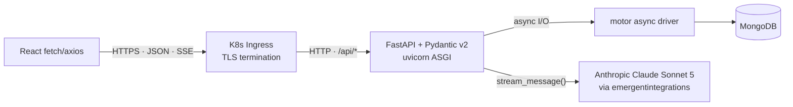

### Contract examples

```json
// POST /api/auth/login   →   200
{
  "access_token": "eyJ…",
  "token_type": "bearer",
  "user": { "id": "…", "email": "…", "name": "…", "role": "admin" }
}
```

```
// POST /api/ai/insight   →   text/event-stream
data: {"session_id":"c8f9…"}

data: {"delta":"I don't have live telemetry for INV-04,"}
data: {"delta":" so I can't confirm severity…"}
data: {"done": true}
```

---

## 05 · Test Suite

### Test pyramid

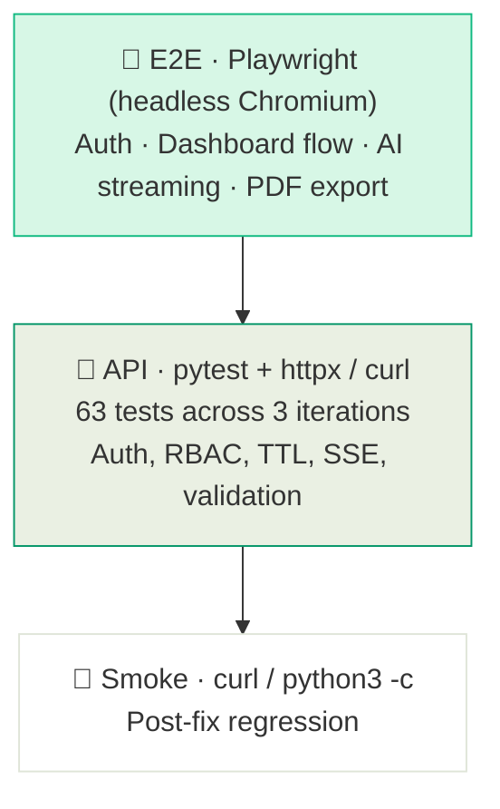

### Coverage by iteration

| Iteration | Backend | Frontend | Focus |
| --- | --- | --- | --- |
| 1 | 12/12 | ✅ full | Auth, contact, protected metrics |
| 2 | 20/20 | ✅ full | Password reset, polling, Claude SSE, PDF export |
| 3 | 43/43 | ✅ full + minor UI notes | Sessions, alerts, team RBAC, scheduler |
| Total | **63/63 backend, 100 % frontend flows** | | |

### Test authoring conventions

- **`data-testid`** on every interactive element — kebab-case, function-descriptive.
- Backend tests live under `/app/backend/tests/` (created by test-agent).
- E2E runs against the real preview URL (`REACT_APP_BACKEND_URL`), never localhost, so ingress + CORS are exercised.
- Test credentials are read from `/app/memory/test_credentials.md` — never hard-coded.
- Reports written to `/app/test_reports/iteration_{n}.json`.

### Testing tools

| Tool | Where | Purpose |
| --- | --- | --- |
| **pytest** + **httpx** | Backend | Endpoint contracts, auth, RBAC, TTL |
| **Playwright (async python)** | E2E | UI flows, streaming, PDF download |
| **curl + python3 -c** | Smoke | Quick regression after fixes |
| **mongosh** | Manual | Index + document verification |
| **testing_agent tool** | Orchestrator | Runs both suites & files reports |

---

## 06 · Agentic AI Workflows and Model Details with Orchestration

### Agent architecture

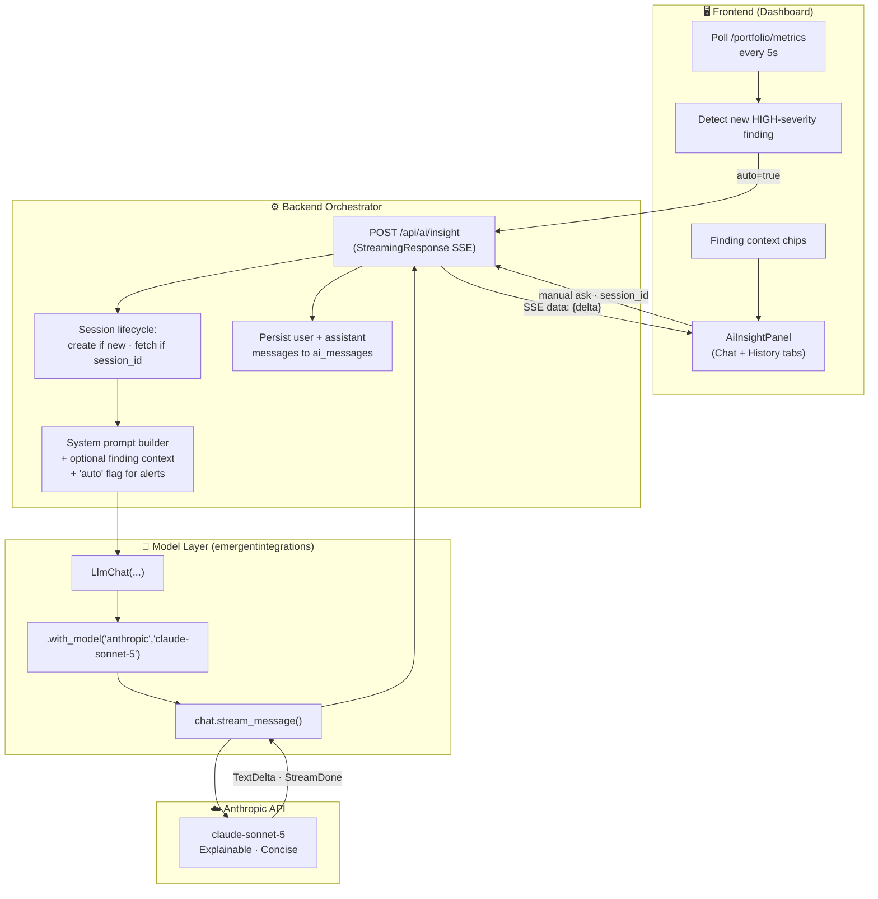

### Prompt & context assembly

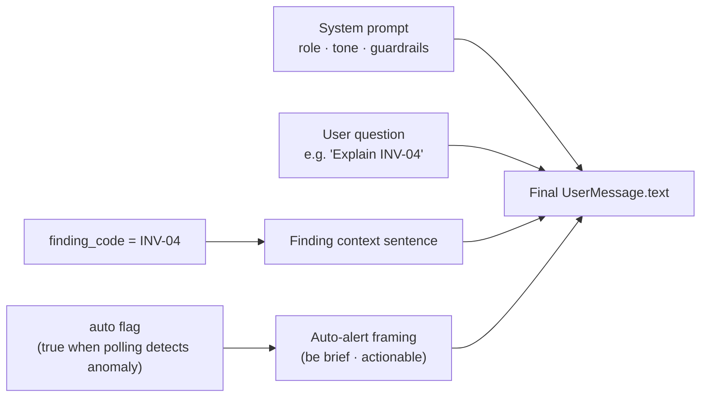

**System prompt (verbatim):**
> You are the Green Solutions AI Insight Assistant — an explainable AI for renewable energy operations. Answer concisely (max 5 short sentences). Ground answers in solar/wind operations: inverters, strings, soiling, thermal drift, communication dropouts, curtailment. When you make a recommendation, prefix it with 'Action:'. Never invent SLAs or financials.

### Streaming lifecycle

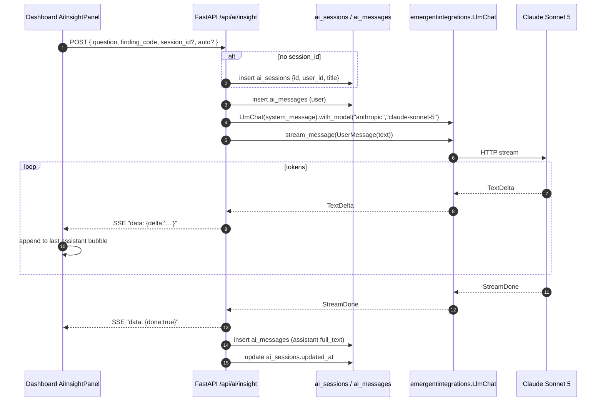

### Model details

| Attribute | Value |
| --- | --- |
| Provider | Anthropic |
| Model | `claude-sonnet-5` |
| SDK | `emergentintegrations 0.2` |
| Auth | `EMERGENT_LLM_KEY` (universal, injected via env) |
| Streaming | `stream_message()` (SSE) — always used |
| Response headers | `text/event-stream` + `X-Accel-Buffering: no` (nginx flush) |
| Session id (LLM-side) | `f"insight-{session_id}"` — stable per convo |
| Session id (Mongo-side) | `ai_sessions.id` (uuid4) — owns the message log |
| Message store | `ai_messages` — user + assistant, plus `auto` + `finding_code` metadata |
| Guardrails | System prompt (concise · grounded · no financial hallucination) |

### Autonomous behaviors (agent triggers)

| Trigger | Origin | Payload | Effect |
| --- | --- | --- | --- |
| Manual chat send | User → `ai-send` | free-text | `askAbout` — normal Claude reply |
| Finding row → "ASK AI" | User → `ask-ai-<code>` | code + title | `askAbout(code)` — scoped explanation |
| **Anomaly auto-alert** | Polling loop detects new high-sev code | code + title, `auto=true` | Toast + `autoAsk(code)` + push to Alert Center |
| Session resume | History tab → `session-<id>` | session_id | Fetch messages, continue same LLM thread |

### Extensibility hooks

- `LlmChat.with_model("openai" | "gemini" | "anthropic", "...")` — swap model per env / role.
- `custom_headers={...}` — Anthropic `task-budgets-2026-03-13` header when scaling to Opus 4.7.
- Extra body (`extra_body`) — enable `thinking: adaptive` for deeper reasoning modes when needed.
- Persist arbitrary tool-call metadata in `ai_messages` for future function-calling / RAG additions.

---

## Appendix A · Environment configuration

```
backend/.env
  MONGO_URL=…                 # local mongo
  DB_NAME=test_database
  CORS_ORIGINS=*
  JWT_SECRET=<64 hex>
  ADMIN_EMAIL=admin@greensolutions.ai
  ADMIN_PASSWORD=Admin@123
  FRONTEND_URL=https://…      # used for reset + snapshot URLs
  EMERGENT_LLM_KEY=sk-emergent-…

frontend/.env
  REACT_APP_BACKEND_URL=https://…preview.emergentagent.com
  WDS_SOCKET_PORT=443
```

## Appendix B · Directory map

```
/app
├── backend/
│   ├── server.py               # All routes + models + startup + AI orchestration
│   ├── requirements.txt
│   ├── tests/                  # pytest suites (backend_test.py, test_iteration3.py)
│   └── .env
├── frontend/
│   ├── src/{App.js,index.css,context/,lib/,components/,pages/}
│   ├── package.json            # jspdf, html2canvas, sonner, framer-motion, shadcn/ui, …
│   └── .env
├── memory/
│   ├── PRD.md                  # Roadmap & backlog
│   ├── test_credentials.md     # Admin creds, endpoint index
│   └── ARCHITECTURE.md         # ← this file
├── test_reports/               # iteration_*.json — testing-agent artefacts
└── auth_testing.md             # Auth playbook (from integration expert)
```
